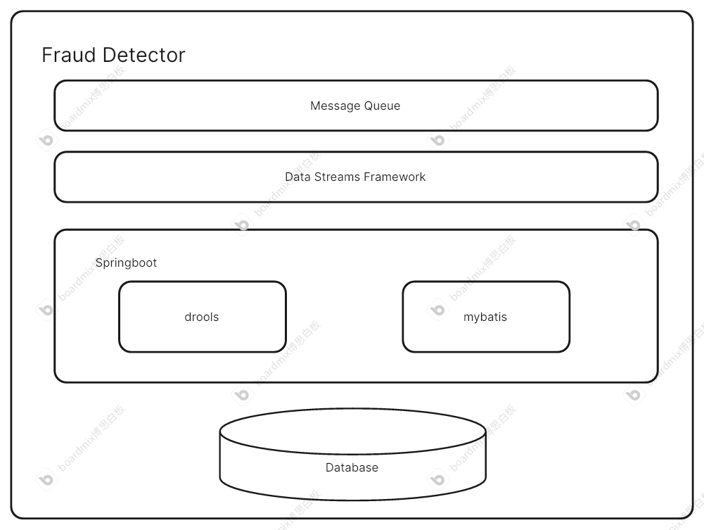
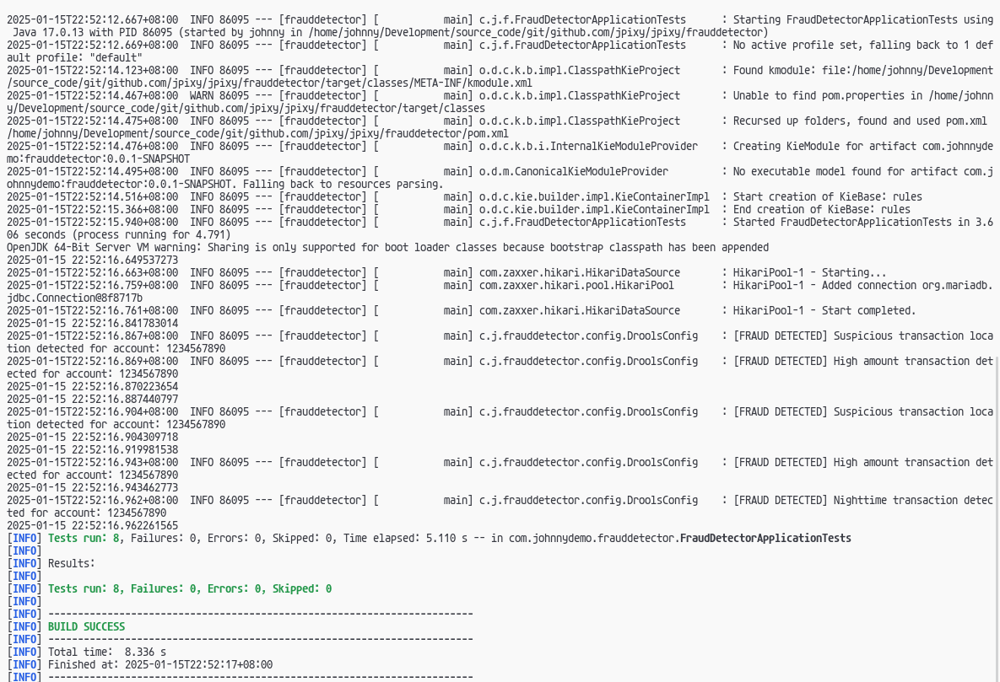
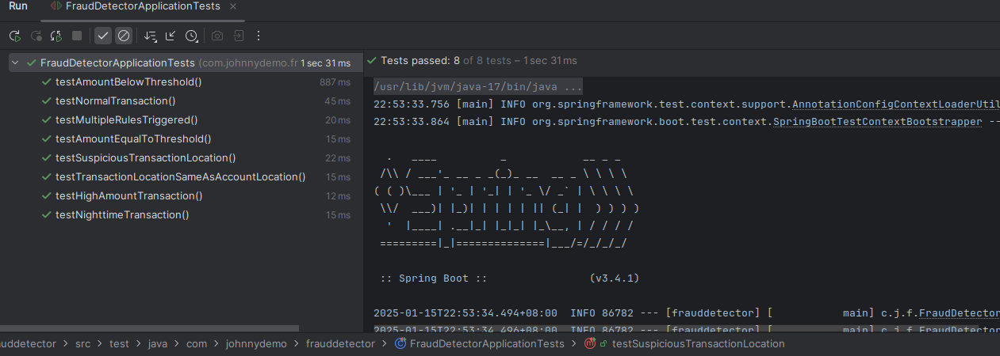

# Readme

[English version](./README.md)

## 这是什么？

这是一个银行欺诈交易检测系统。

- 高并发， 高性能
- 在云环境中提供自动伸缩性， 提高高可用性
- 根据预定义的规则进行欺诈检测
  如果你想在生产环境中使用它， 那么你最好参考这些[生产环境中使用的建议](#如果在生产环境中使用需要注意什么)

## 架构设计



要点介绍

- Message Queue， 可以采用Kafka， RocketMQ等常见消息队列，也可以使用云厂商提供的MQ产品，如AWS SQS
- Data Streams Framework, 可以选型Flink
- Drools 是进行预定义欺诈规则的组件，支持热部署，业务人员可以不懂技术代码，用独特的规则语言来建立欺诈规则
- 生产环境中，会有生产者消费者的agent和MQ组成前置，最终Springboot + Mybatis的组合将数据持久化到DB中去。

如果你想了解更多的调研阶段的故事，[请参阅这里](#调研阶段的故事)

## 如何使用

### 一些准备工作

- JDK 17
- Maven, 最好配置好国内仓库镜像
- Docker + docker-compose， 同样最好配置好国内仓库镜像
- K8S

### 下载源码到本地

```declarative
git clone https://github.com/jpixy/frauddetector.git
cd frauddetector/
```

### 尝试运行下单元测试

```declarative
make test
```





#### 欺诈规则

```declarative

异常交易地点：
检查交易地点是否与账户注册地点不一致。
如果不一致，则标记为欺诈交易，并记录日志。

夜间交易：
检查交易时间是否在夜间（22:00 至 06:00）。
如果是夜间交易，则标记为欺诈交易，并记录日志。

大额交易：
检查交易金额是否超过 10000 元。
如果超过，则标记为欺诈交易，并记录日志。

```

从测试截图上，可以看到提供了如下几项单元测试，并测试通过：

- 低于阈值的交易
- 正常交易
- 多种规则叠加检测的交易
- 等于阈值的交易
- 交易地质异常的交易
- 交易地址不变的交易
- 高于阈值的交易
- 夜间的交易

### 编译项目

```declarative
make build
```

### 打包成docker image

```declarative
make docker-build
```

### 本地基于docker，运行整个系统进行体验

```declarative
make run

# 停止整个项目

make stop
```

### 在k8s环境中进行部署等操作

```declarative
make k8s-deploy
make k8s-list
make k8s-delete
```

#### 如何在K8S环境中实现自动伸缩

```declarative
# 主要核心代码在helm chart中配置了hpa

autoscaling:
enabled: true
minReplicas: 3
maxReplicas: 10
targetCPUUtilizationPercentage: 80

这里设定的阈值CPU占用率达到80%，则开始触发自动伸缩

如果想测试伸缩性，可以使用下面工具进行测试：

hey -z 1m -c 10 -q 10 http://<kube-IP>:8080
```

更多的命令和操作，请参阅Makefile文件

### 测试代码和期望输出

#### 创建高金额交易记录

```shell
curl -X POST http://localhost:8080/v1/transactions \
  -H "Content-Type: application/json" \
  -d '{
    "accountNumberFrom": "1234567890",
    "accountNumberTo": "0987654321",
    "amount": 15000.00,
    "transactionType": "DEBIT",
    "isFraud": false,
    "status": "PENDING"
  }'

# Logs

2025-01-15T15:31:43.970Z  INFO 1 --- [frauddetector] [nio-8080-exec-1] c.j.frauddetector.config.DroolsConfig    : [FRAUD DETECTED] High amount transaction detected for account: 1234567890


```

#### 交易地点异常

```declarative
curl -X POST http://localhost:8080/v1/transactions \                                          
-H "Content-Type: application/json" \
-d '{
"accountNumberFrom": "1234567890", "accountNumberTo": "0987654321", "accountLocation": "Beijing", "transactionLocation": "Shanghai", "amount": 1000.00,
"transactionType": "DEBIT", "isFraud": false, "status": "PENDING"
}'

# Logs

2025-01-15T15:33:25.090Z  INFO 1 --- [frauddetector] [nio-8080-exec-3] c.j.frauddetector.config.DroolsConfig    : [FRAUD DETECTED] Suspicious transaction location detected for account: 1234567890

```

其他的增删改查Restful API也都存在，具体可以查阅代码进行测试

## 如果在生产环境中使用需要注意什么

- 添加完整的消息队列和流处理框架，作为前置，然后调用本例子中的检测交易的API进行欺诈判断
- 使用消息队列， 要准备生产者和消费者的agent
- 消息队列的消费者直接发送消息到流处理端， 如Flink
- 数据库表结构中的ID，这里简化成数据库自增ID，生产环境中考虑使用分布式ID生成
- 数据库可能要考虑分表分库
- 甚至在业务层和数据库之间增加缓存层
- 交易表中简化成只考虑account的情况，实际中存在user和account关系，通常一个user下面有多个accounts的实际情况。

## 调研阶段的故事

在开发之前，大概调研了一些云厂商的一些云产品。

以下是目标：
- AWS EKS, GCP GKE, Alibaba ACK
- AWS SQS, GCP Pub/Sub,Alibaba Message Service
- AWS CloudWatch,GCP Stackdriver, Alibaba Cloud Log Servic

最先考察AWS EKS, GCP GKE, Alibaba ACK， 这三个产品。这是部署的基座，只有选型好了三者之一，才可能考虑其他的附属产品。
- Alibaba ACK， 经实践，已经取消测试版本， 目前只提供Pro版本供使用
- GCP GKE， 纵观整个Google cloud平台提供的产品和其他友商比较起来都比较缺少
- AWS EKS， 最终的选择

下面是作demo的时候，运行的操作命令，

### 通过CLI来创建AWS EKS

首先需要安装好eksctl， aws cli， helm等工具, 我们采用的us-east-1 region
```declarative
eksctl create cluster -f cluster-config.yaml
export CLUSTER_REGION=us-east-1
export CLUSTER_VPC=$(aws eks describe-cluster --name web-quickstart --region $CLUSTER_REGION --query "cluster.resourcesVpcConfig.vpcId" --output text)
helm repo add eks https://aws.github.io/eks-charts
helm repo update eks


helm install aws-load-balancer-controller eks/aws-load-balancer-controller \
--namespace kube-system \
--set clusterName=web-quickstart \
--set serviceAccount.create=false \
--set region=${CLUSTER_REGION} \
--set vpcId=${CLUSTER_VPC} \
--set serviceAccount.name=aws-load-balancer-controller

## 注意这一步，需要科学上网， 而我为了方便，直接利用了海外的VM来操作上面的一步。

kubectl create namespace johnny-dev --save-config
kubectl apply -n johnny-dev -f app.yaml
kubectl get ingress -n johnny-dev

```

### 使用AWS SQS

SQS的创建比较简单，略。直接给出通过Java代码来实现发送和接受消息的关键代码

```pom.xml
        <dependencies>
            <dependency>
                <groupId>software.amazon.awssdk</groupId>
                <artifactId>bom</artifactId>
                <version>${aws.java.sdk.version}</version>
                <type>pom</type>
                <scope>import</scope>
            </dependency>
        </dependencies>

```

SQS中发送， 接收，和删除消息。下面是完整的Java代码示例

```java
package com.johnnydemo.aws;

import com.johnnydemo.utils.RandomStringGenerator;
import software.amazon.awssdk.auth.credentials.AwsBasicCredentials;
import software.amazon.awssdk.auth.credentials.StaticCredentialsProvider;
import software.amazon.awssdk.regions.Region;
import software.amazon.awssdk.services.sqs.SqsClient;
import software.amazon.awssdk.services.sqs.model.*;

import java.util.List;

public class SQSWrapper {
    public static void main(String[] args) {
        String queueName = "J_SQS_01";
        String message = RandomStringGenerator.generateRandomString(20);

        // 显式指定临时凭证
        AwsBasicCredentials awsCreds = AwsBasicCredentials.create("<your ID>", "<your key>");

        SqsClient sqsClient = SqsClient.builder()
                .region(Region.US_EAST_1)
                .credentialsProvider(StaticCredentialsProvider.create(awsCreds))
                .build();
        sendMessage(sqsClient, queueName, message);
        receiveMessage(sqsClient, queueName);
        sqsClient.close();
    }

    public static String getQueueURL(SqsClient sqsClient, String queueName) {
        CreateQueueRequest request = CreateQueueRequest.builder()
                .queueName(queueName)
                .build();
        sqsClient.createQueue(request);

        GetQueueUrlRequest getQueueRequest = GetQueueUrlRequest.builder()
                .queueName(queueName)
                .build();

        return sqsClient.getQueueUrl(getQueueRequest).queueUrl();
    }


    public static void sendMessage(SqsClient sqsClient, String queueName, String message) {
        try {

            SendMessageRequest sendMsgRequest = SendMessageRequest.builder()
                    .queueUrl(getQueueURL(sqsClient, queueName))
                    .messageBody(message)
                    .delaySeconds(5)
                    .build();

            sqsClient.sendMessage(sendMsgRequest);

        } catch (SqsException e) {
            System.err.println(e.awsErrorDetails().errorMessage());
            System.exit(1);
        }
    }

    public static void receiveMessage(SqsClient sqsClient, String queueName) {
        try {
            ReceiveMessageRequest receiveMessageRequest = ReceiveMessageRequest.builder()
                    .queueUrl(getQueueURL(sqsClient, queueName))
                    .maxNumberOfMessages(5)
                    .build();

            List<Message> msgList = sqsClient.receiveMessage(receiveMessageRequest).messages();

            System.out.println("=== Get " + msgList.size() + " messages from SQS ===");
            for(Message msg : msgList){
                System.out.println("=== The message is : "+ msg + " ===");
            }
            deleteMessage(sqsClient, queueName, msgList);
            System.out.println("=== Delete " + msgList.size() + " messages from SQS ===");

        } catch (SqsException e) {
            System.err.println(e.awsErrorDetails().errorMessage());
            System.exit(1);
        }
    }

    public static void deleteMessage(SqsClient sqsClient, String queueName, List<Message> msgList) {
        try {
            for (Message message : msgList) {
                DeleteMessageRequest deleteMessageRequest = DeleteMessageRequest.builder()
                        .queueUrl(getQueueURL(sqsClient, queueName))
                        .receiptHandle(message.receiptHandle())
                        .build();
                sqsClient.deleteMessage(deleteMessageRequest);
            }
        } catch (SqsException e) {
            System.err.println(e.awsErrorDetails().errorMessage());
            System.exit(1);
        }
    }
}


```
### AWS的费用

在使用上述的配置情况下，使用AWS EKS和SQS， 会大约产生每天 5.5 - 7+ 美元的费用， 具体费用受到使用的流量等多种因素影响。